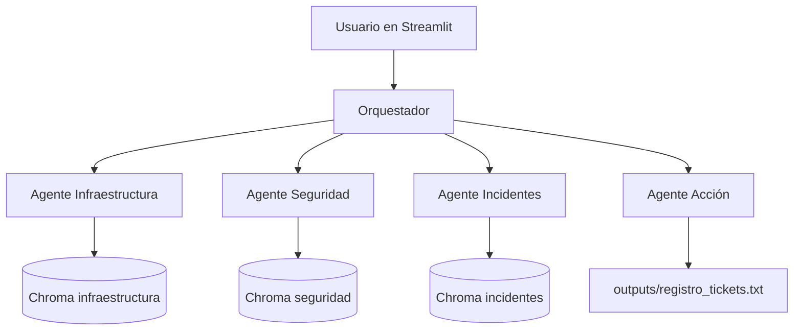

# PatitoDesk IA

Prototipo académico de mesa de ayuda con IA para Patito S.A. Usa Streamlit, LangChain, Gemini, Chroma y agentes especializados para responder desde documentos internos y registrar tickets locales.

## Qué hace

- Responde preguntas sobre servicios TI, seguridad y gestión de incidentes.
- Usa RAG con tres bases documentales separadas.
- Enruta cada pregunta al agente correcto.
- Permite preparar tickets de software o incidentes.
- Guarda tickets confirmados en `outputs/registro_tickets.txt`.

## Requisitos

- Python 3.11 recomendado.
- API key de Google AI Studio.
- Windows PowerShell o CMD.
- Una terminal abierta en la carpeta del proyecto:

```text
C:\Users\Usuario\Documents\Patito-SA
```

## Instalación con pip en PowerShell

```powershell
cd C:\Users\Usuario\Documents\Patito-SA
python --version
python -m venv .venv
.\.venv\Scripts\Activate.ps1
python -m pip install --upgrade pip
pip install -r requirements.txt
Copy-Item .env.example .env
notepad .env
python -m app.rag.build_indexes
python -m streamlit run app/streamlit_app.py
```

## Instalación con pip en CMD

```bat
cd /d C:\Users\Usuario\Documents\Patito-SA
python --version
python -m venv .venv
.venv\Scripts\activate.bat
python -m pip install --upgrade pip
pip install -r requirements.txt
copy .env.example .env
notepad .env
python -m app.rag.build_indexes
python -m streamlit run app/streamlit_app.py
```

## Instalación con uv en PowerShell

Si no tenés `uv`, instalalo primero:

```powershell
powershell -ExecutionPolicy ByPass -c "irm https://astral.sh/uv/install.ps1 | iex"
```

Luego ejecutá el proyecto:

```powershell
cd C:\Users\Usuario\Documents\Patito-SA
uv venv --python 3.11
.\.venv\Scripts\Activate.ps1
uv pip install -r requirements.txt
Copy-Item .env.example .env
notepad .env
uv run python -m app.rag.build_indexes
uv run streamlit run app/streamlit_app.py
```

## Instalación con uv en CMD

Si no tenés `uv`, instalalo primero:

```bat
powershell -ExecutionPolicy ByPass -c "irm https://astral.sh/uv/install.ps1 | iex"
```

Luego ejecutá el proyecto:

```bat
cd /d C:\Users\Usuario\Documents\Patito-SA
uv venv --python 3.11
.venv\Scripts\activate.bat
uv pip install -r requirements.txt
copy .env.example .env
notepad .env
uv run python -m app.rag.build_indexes
uv run streamlit run app/streamlit_app.py
```

## Configuración del archivo .env

Después de copiar `.env.example` a `.env`, abrí `.env` y reemplazá `tu_api_key_aqui` por tu API key real.

```env
GOOGLE_API_KEY=tu_api_key_aqui
GEMINI_LLM_MODEL=gemini-3.1-flash-lite
GEMINI_EMBEDDING_MODEL=gemini-embedding-2
CHUNK_SIZE=800
CHUNK_OVERLAP=120
RETRIEVER_K=3
```

No compartas el archivo `.env`. Contiene credenciales.

## Ejecución diaria

Si ya instalaste todo y ya configuraste `.env`, solo necesitás activar el entorno y levantar Streamlit.

PowerShell:

```powershell
cd C:\Users\Usuario\Documents\Patito-SA
.\.venv\Scripts\Activate.ps1
python -m streamlit run app/streamlit_app.py
```

CMD:

```bat
cd /d C:\Users\Usuario\Documents\Patito-SA
.venv\Scripts\activate.bat
python -m streamlit run app/streamlit_app.py
```

Con uv, también podés ejecutar sin activar manualmente:

```powershell
uv run streamlit run app/streamlit_app.py
```

## Regenerar índices

Ejecutá esto cuando cambien los archivos dentro de `data/` o cuando cambie `GEMINI_EMBEDDING_MODEL`.

```powershell
python -m app.rag.build_indexes
```

Esto crea o actualiza:

- `vectorstores/infraestructura`
- `vectorstores/seguridad`
- `vectorstores/incidentes`

## Ejecutar pruebas

PowerShell o CMD:

```powershell
pytest -q
```

Con uv:

```powershell
uv run pytest -q
```

## Uso de la aplicación

1. Abrí la URL que muestra Streamlit en la terminal.
2. Escribí una pregunta sobre servicios TI, seguridad o incidentes.
3. Revisá la respuesta y las fuentes recuperadas.
4. Para tickets, escribí una solicitud con los datos requeridos.
5. Confirmá el ticket solo cuando la app muestre que los datos están completos.

Ejemplos listos para probar: `examples/preguntas_prueba.md`.

## Datos requeridos para tickets

Solicitud de software:

- software
- versión
- motivo
- jefe que aprueba

Incidente:

- sistema afectado
- descripción
- prioridad

Si falta información, la app no registra el ticket.

## Estructura del proyecto

```text
app/                    Código principal
data/                   Documentos base para RAG
docs/                   Documentación de instalación y uso
examples/               Preguntas de prueba
outputs/                Tickets registrados localmente
tests/                  Pruebas automatizadas
vectorstores/           Índices Chroma generados localmente
.env.example            Plantilla de configuración
requirements.txt        Dependencias Python
```

## Arquitectura



## Reglas importantes

- La app responde usando solo la base documental proporcionada.
- Si no encuentra información suficiente, debe responder:

```text
No encontré información suficiente en la base documental proporcionada.
```

- Los índices no se regeneran solos al abrir Streamlit.
- Si cambiás documentos o modelo de embeddings, regenerá índices.
- Si aparece un error de importación, ejecutá los comandos desde la raíz del proyecto.

## Más documentación

- `docs/instalacion-y-uso.md`: guía completa de instalación, ejecución, uso, pruebas y problemas comunes.
