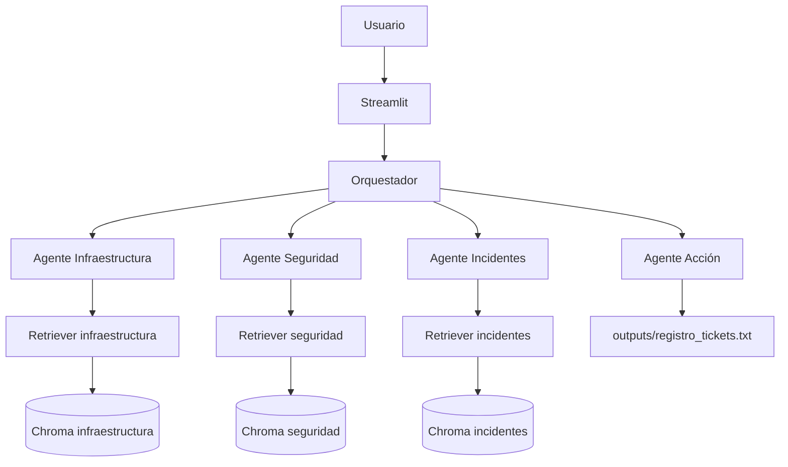
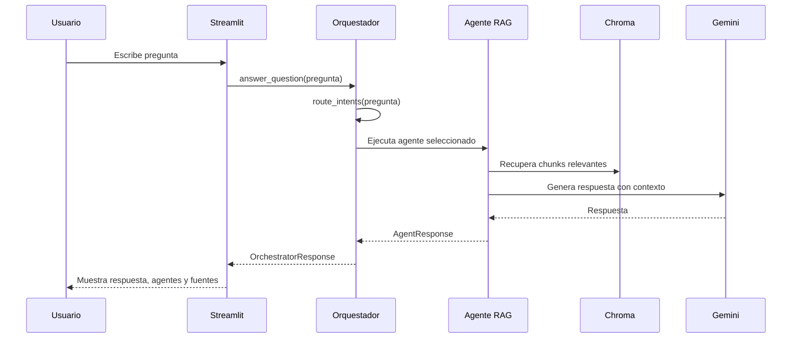
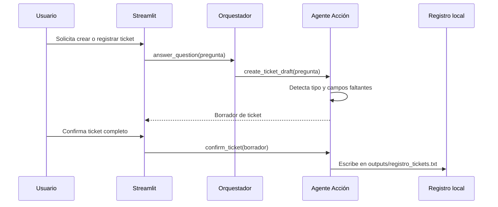

# Arquitectura de PatitoDesk IA

La arquitectura está organizada en capas simples: interfaz, orquestación, agentes, recuperación documental, configuración y persistencia local.

## Vista general

## Capas

| Capa | Responsabilidad | Archivos principales |
|------|-----------------|----------------------|
| Interfaz | Recibe preguntas, muestra respuestas, fuentes y confirmación de tickets. | `app/streamlit_app.py` |
| Orquestación | Detecta intención y decide qué agentes ejecutar. | `app/orchestrator/router.py` |
| Agentes RAG | Consultan documentos por dominio y generan respuestas. | `app/agents/base_rag_agent.py`, `app/agents/*_agent.py` |
| Acción | Valida datos y prepara o registra tickets. | `app/agents/action_agent.py` |
| RAG | Crea embeddings, carga Chroma y expone retrievers. | `app/rag/build_indexes.py`, `app/rag/vectorstores.py` |
| Modelos de datos | Define respuestas, fuentes y tickets. | `app/schemas/*.py` |
| Configuración | Centraliza rutas, variables y bases de conocimiento. | `app/config.py` |
| Persistencia local | Guarda índices y tickets generados. | `vectorstores/`, `outputs/` |

## Flujo de una pregunta

## Flujo de un ticket

## Por qué no hay una sola base vectorial

Separar los índices por agente mejora tres cosas:

- Trazabilidad: cada respuesta indica de qué documento salió la fuente.
- Control: un agente no responde con información de otro dominio.
- Depuración: si falla un tema, se revisa su índice y documento específico.
